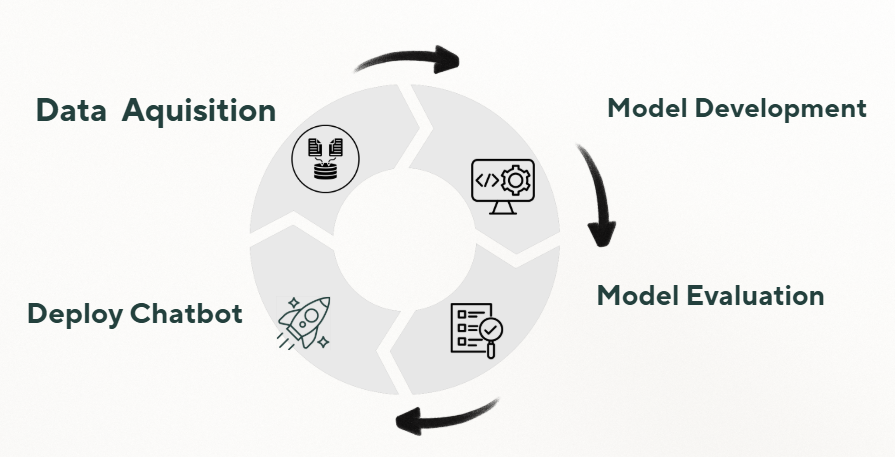
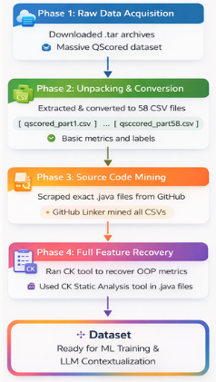
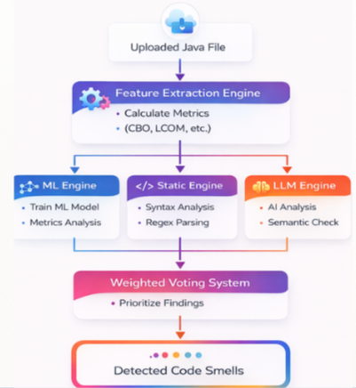
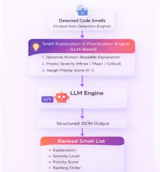
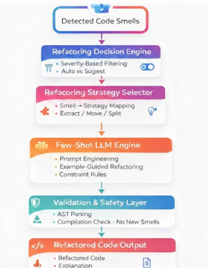
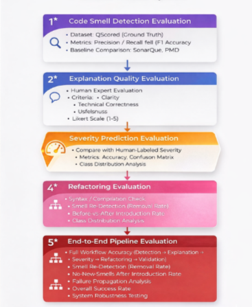
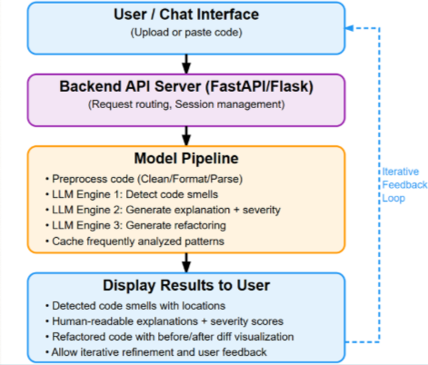
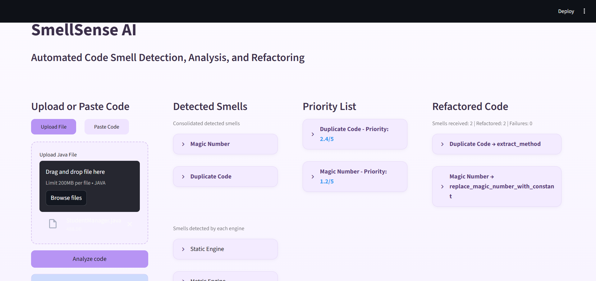
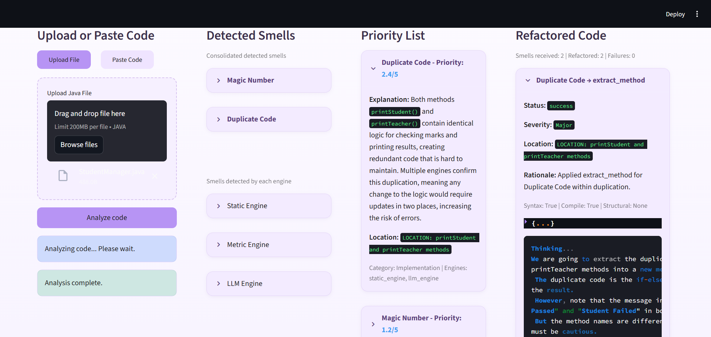

## Team

- E/20/062, K.S. Dhananji, [email](mailto:e20062@eng.pdn.ac.lk)
- E/20/367, Binuri Senavirathna, [email](mailto:e20367@eng.pdn.ac.lk)
- E/20/350, J.P.D.N. Sandamali, [email](mailto:e20350@eng.pdn.ac.lk)

### Supervisors

- Mr. Biswajith Dissanayake — Lecturer (Prob)
- Mr. Thilina Gunarathne — Lecturer (Prob)

---

## Table of Contents

1. [Introduction](#introduction)
2. [Research Problem](#research-problem)
3. [Objectives](#objectives)
4. [Proposed Solution](#proposed-solution)
5. [System Architecture](#system-architecture)
6. [Methodology](#methodology)
7. [Results](#results)
8. [Impact & Limitations](#impact--limitations)
9. [Future Work](#future-work)
10. [Getting Started](#getting-started)
11. [Links](#links)

---

## Introduction

Modern software systems continue to grow rapidly in size and complexity. As projects evolve, maintaining clean and maintainable code becomes increasingly difficult. Poor coding practices often introduce code smells, which indicate deeper structural and maintainability issues within software systems.

SmellSense AI is a research-based intelligent system designed to automatically detect, explain, prioritize, and refactor code smells using a hybrid combination of static analysis, software metrics, and Large Language Models (LLMs).

The system provides an end-to-end workflow that assists developers in improving software quality and maintainability through intelligent automated refactoring.

---

## Research Problem

Manual code smell detection is time-consuming, inconsistent, and difficult to scale across large software systems.

Traditional static analysis tools:

- Depend heavily on rule-based detection
- Lack contextual explanations
- Do not provide severity analysis
- Usually stop at detection without automated refactoring support

Standalone LLM-based approaches also introduce challenges such as:

- Inconsistent outputs
- Invalid or unverified refactoring
- Lack of structured prioritization

SmellSense AI addresses these limitations through a hybrid intelligent pipeline.

---

## Objectives

The primary objectives of the project are:

- Detect code smells using multiple detection engines
- Explain detected smells and assess severity
- Automatically generate safe refactoring solutions
- Provide a complete end-to-end workflow for developers

---

## Proposed Solution

SmellSense AI introduces a fully integrated LLM-powered pipeline that:

- Detects multiple code smells
- Generates explanations and severity rankings
- Prioritizes smells based on impact
- Produces automated refactoring suggestions
- Validates generated outputs
- Provides chatbot-based interaction for developers

---

## System Architecture

The system consists of multiple integrated components working together to provide intelligent code analysis and refactoring support.

### Main Components

- Frontend chatbot interface
- Backend API server
- Feature extraction engine
- Static analysis engine
- Metric analysis engine
- LLM semantic analysis engine
- Refactoring and validation engine

---

## Methodology



The methodology consists of several major stages.

### Data Acquisition



The dataset preparation process includes:

- Downloading datasets
- Cleaning and extracting source code
- Mining Java projects from GitHub
- Recovering software metrics
- Preparing datasets for ML training

### Code Smell Detection



The detection process includes:

- Feature extraction
- Static analysis
- Regex parsing
- Metrics analysis
- AI semantic analysis

### Smell Explanation & Prioritization



The prioritization engine:

- Generates human-readable explanations
- Predicts severity levels
- Assigns priority scores
- Produces ranked smell lists

### Automated Refactoring



The refactoring process includes:

- Refactoring decision engine
- Smell-to-strategy mapping
- Prompt engineering
- Validation and repair mechanisms

### Model Evaluation



Evaluation measures:

- Detection accuracy
- Refactoring correctness
- Runtime performance
- Workflow efficiency

### Chatbot Development



The chatbot interface enables users to:

- Upload or paste code
- View detected smells
- Read explanations
- Access refactoring suggestions

---

## Results

The proposed system demonstrates improvements over traditional tools and standalone LLM approaches.

### Chatbot Interface Results

The chatbot interface acts as the primary interaction layer between the user and the backend analysis pipeline.

The workflow includes:

1. User uploads or pastes source code
2. Detection engines analyze the code
3. Detected smells are consolidated
4. Priority rankings are generated
5. Refactoring suggestions are produced
6. Results are displayed to the user

---

### Initial Detection Results

The following interface demonstrates the initial analysis results generated after code submission.



This interface displays:

- Uploaded source code input section
- Consolidated detected smells
- Severity-based priority rankings
- Initial refactoring recommendations

---

### Detailed Analysis and Refactoring Results

The following interface demonstrates detailed chatbot outputs after selecting detected smells and generated refactoring suggestions.



This interface displays:

- Detailed smell explanations
- Severity information
- Affected code locations
- Refactoring rationale
- Validation results
- Generated refactored code

---

### Key Improvements

- Better detection coverage
- Structured explanations
- Smell-aware refactoring
- Improved output reliability
- End-to-end workflow integration

---

## Impact & Limitations

### Impact

- Improves software maintainability
- Enhances developer productivity
- Combines static analysis with AI techniques
- Provides a modular research framework

### Limitations

- Validation mainly focuses on syntax and compilation
- Dependent on local LLM performance
- Structural smells remain challenging

---

## Future Work

Future improvements include:

- IDE plugin integration
- Support for additional programming languages

---

## Getting Started

### Prerequisites

- Python 3.10+
- Java Runtime Environment
- Ollama running locally

---

### Run Backend

````bash
python -m backend.app.main
```

Backend API:

```text
http://localhost:8000
````

---

### Run Frontend

```bash
streamlit run frontend/ui/chatbot_ui.py
```

Frontend UI:

```text
http://localhost:8501
```

---

## Links

- [GitHub Repository](https://github.com/cepdnaclk/e20-4yp-Automated-Code-Smell-Detection-and-Refactoring-with-LLMs)
- [Project Website](https://cepdnaclk.github.io/e20-4yp-Automated-Code-Smell-Detection-and-Refactoring-with-LLMs/)
- [Department of Computer Engineering](http://www.ce.pdn.ac.lk/)
- [University of Peradeniya](https://eng.pdn.ac.lk/)
